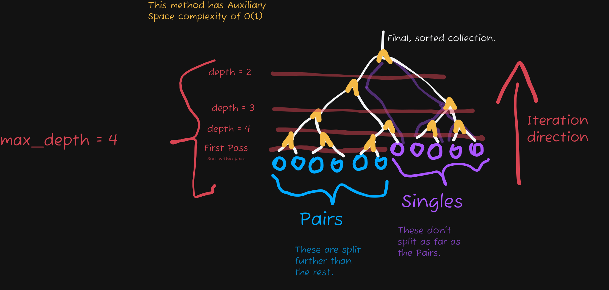

Sorting and searching are *both* valuable types of algorithm for a programmer
to have under her belt.

If you are---for example---implementing your own custom `Dictionary` class,
you'd need a searching algorithm to scan through keys. Getting an element from
a dictionary isn't free like it is for a pointer-array-style list.

The finished code is available [here,](./unordered-dictionary.py) if you want
to skip ahead.

Here's the first iteration of the class, without any of the fancy sorting &
searching algorithms:

```python
"""An implementation of an unordered dictionary."""

from typing import Any


class UnorderedDictionary[ElementType = Any]:
    """An implementation of an unordered dictionary.

    Created to demonstrate various sorting and searching algorithms.
    """

    def __init__(self, keys: list[str], values: list[ElementType]) -> None:
        """Initialize using raw `keys` and `values` lists.

        Args:
            keys: Keys of the elements.
            values: Values of each elements.

        Raises:
            ValueError:
                If the length of the `keys` and `values` lists do not match.
        """
        if len(keys) != len(values):
            msg: str = "Length of `keys` and `values` lists does not match."
            raise ValueError(msg)

        self.keys = keys
        self.values = values

    @staticmethod
    def from_dict(
        base_dict: dict[str, ElementType],
    ) -> UnorderedDictionary[ElementType]:
        """Create an `UnorderedDictionary` based on a Python `dict`.

        Args:
            base_dict: The `dict` to get the keys and values from.

        Returns:
            A `UnorderedDictionary` with the same keys and values as the
            provided `dict`.
        """
        return UnorderedDictionary(
            list(base_dict.keys()),
            list(base_dict.values()),
        )

    def get_by_linear_search(self, key: str) -> ElementType | None:
        """Get an element of the dictionary using a linear search algorithm.

        This is the simplest (and most inefficient) searching algorithm.
        It simply loops over the keys until it finds the one we're looking for.

        Args:
            key: The key associated with the value to get.

        Returns:
            The value associated with the key, or `None` if the key is
            not defined.
        """
        found_index: int = -1

        for i, key_i in enumerate(self.keys):
            if key_i == key:
                found_index = i
                break

        if found_index == -1:
            return None

        return self.values[found_index]
```

The linear search---though simple to implement---can be quite inefficient for
larger data-structures. The Big-O notation is $O(n)$, meaning that in the
worst-case scenario, this takes an amount of time proportional to the size of
the dictionary.

Better is possible. In the next section, I'll show the *Binary Search*
algorithm.

## Binary Search

The *Binary Search* algorithm brings the time-complexity down to $O(\log_2 n)$.
That's a huge improvement, and only saves more as the dictionary size
increases.

There's a downside however; the dictionary must be sorted by the keys.

Here's how it might go:

1. Pick the key *right* in the middle of the sorted dictionary.
2. Check whether that key is above or if it's below the key we're looking for.
   This is possible because the keys are sorted (i.e. lexicographically)
3. If it's above, start again at 3/4 through the dict, if it's below, 1/4.

It's like playing a number guessing game! With this algorithm, it narrows down
the possibility by huge amounts at a time.

It can be implemented like this:

```python
def get_by_binary_search(self, key: str) -> _GetterReturnType:
    """Get an element of the dictionary using the Binary Search algorithm.

    The dictionary is expected to be sorted lexicographically before
    execution of this method. Most of the time (unreliably), this method
    will incorrectly return `None` when the dictionary isn't sorted.

    Args:
        key: The key associated with the value to get.

    Returns:
        The value associated with the key, or `None` if the key is
        not defined.
    """
    # Signifies the range that may contain the key we want.
    search_range: tuple[int, int] = (0, len(self.keys) - 1)

    while True:
        checked_key_index = int((search_range[0] + search_range[1]) / 2)
        checked_key: str = self.keys[checked_key_index]

        if checked_key < key:
            search_range = (checked_key_index + 1, search_range[1])

        elif checked_key > key:
            search_range = (search_range[0], checked_key_index - 1)

        elif checked_key == key:
            return self.values[checked_key_index], checked_key_index

        # This always eventually is true when the key is undefined.
        if search_range[0] > search_range[1]:
            raise KeyError
```

## Sorting

As mentioned above, the dictionary will not work correctly if it isn't sorted.

How do we ensure it's properly sorted? There are several algorithms at our
disposal.

Many high-level programming languages/libraries implement these for us,
including Python. For those that don't however, and for cases where existing
interfaces aren't applicable, it is important to have these in our mental
toolbox.

Here I'll show the implementations of a few different sorting algorithms and
their Big-O analyses.

### Bubble Sort

Bubble sort (or 'sinking sort') is likely the easiest sorting algorithm to
understand and implement, but is quite inefficient (Big-O Time Complexity:
$O(n^2)$). While learning sorting algorithms, it can be the best introductory
option.

Here's how it works:

```python
def sort_by_bubble(self) -> None:
    """Sort the dictionary using the Bubble Sort algorithm.

    Based on <https://www.geeksforgeeks.org/dsa/bubble-sort-algorithm/>.
    """
    # Loop over each element, ensuring each one is in the
    # correct place.
    for i in range(self._len):
        swapped = False

        # Loop over each element *after* element `i`, as `i` and before
        # are already in place.
        for j in range(self._len - i - 1):
            # If the key isn't in order with its successor, swap them.
            # The greater-than operator works on strings, going by
            # lexicographical order.
            if self.keys[j] > self.keys[j + 1]:
                # Swap the key with its successor.
                self.keys[j], self.keys[j + 1] = (
                    self.keys[j + 1],
                    self.keys[j],
                )
                # Swap the value with its successor, to bring them into
                # order relative to eachother.
                self.values[j], self.values[j + 1] = (
                    self.values[j + 1],
                    self.values[j],
                )
                # Track that this operation happened (see below).
                swapped = True

        # If the inner loop didn't cause any sorting, this means no
        # more sorting is necessary.
        if not swapped:
            break

    self._sorted = True  # Used to track whether sorting is needed when
    #                      performing operations that require it to be.
    #
    #                      It was added to __init__, defaulting to `False`.
```

With that sorting algorithm, we can now ensure the dictionary is sorted before
binary searching.

I've removed the note from the docstring about sorting, and added the following
snippet to the start of `get_by_binary_search`:

```python
if not self._sorted:
    self.sort()  # A wrapper function, pointing to a default sort algorithm.
```

`sort` is a defaulted sort algorithm, currently bound to `bubble_sort`. I'll
update it as more optimized algorithms are implemented.

Given all that, we can now run a `binary_search` without having to manually
sort it!:

```{python}
from unordered_dictionary import UnorderedDictionary

udict = UnorderedDictionary.from_dict(
    {
        "C": 4,
        "D": 9,
        "B": 2,
        "A": 1,
    }
)

udict.sort_by_bubble()

print(f"A: {udict.get_by_binary_search('A')[0]}")
print(f"C: {udict.get_by_binary_search('C')[0]}")
```

As we can see, everything is functioning as expected; A is 1, and C is 4.

This may have a little more of a performance impact on the first run (when it
sorts the dictionary,) but on subsequent runs it will be faster than a linear
search.

I'll cover 2 alternatives below; the *insertion sort* algorithm, and the
*quick-merge sort* algorithm (most optimized).

### Insertion Sort

The insertion sort algorithm can be conceptualized like so (using the analogy
of cards):

- You have 2 piles of cards: one sorted, and one not.
- To start, the sorted pile is only the first element, while the rest of the
  collection is considered unsorted.
- We iterate over each unsorted element, and for each we find its place in the
  sorted list (by iteration) and insert it there.

This algorithm isn't more optimized by Big-O analysis (it's the same there;
$O(n^2)$), but according to online sources, it *is* more optimized (Big-O
ignores constants; insertion sort has a smaller time-complexity *coefficient*)

Here it is integrated into the class:

```python
def sort_by_insertion(self) -> None:
    """Sort the dictionary using the Insertion Sort algorithm.

    Based on <https://www.geeksforgeeks.org/dsa/bubble-sort-algorithm/>
    """
    # `i` represents the index of the first element which is unsorted.
    # Everything before `i` is sorted.
    for i in range(1, self._len):
        # Check its relation to each sorted element.
        #
        #  This can use any search algorithm, but here I'm using
        # a linear search for simplicity.
        #
        # As a little bit of a hack, it will end up comparing
        # against itself as a final case when it ends up at the
        # end of the sorted portion.
        for j in range(i + 1):
            if self.keys[j] >= self.keys[i]:
                # Move it to the sorted position.
                if i != j:
                    self.keys.insert(j, self.keys.pop(i))
                    self.values.insert(j, self.values.pop(i))
                break

    self._sorted = True
```

I've set it as the default sort algorithm in the source file.

A test using the same data as before:

```{python}
udict = UnorderedDictionary.from_dict(
    {
        "C": 4,
        "D": 9,
        "B": 2,
        "A": 1,
    }
)

udict.sort_by_insertion()

print(udict)
```

Success!

Now let's move onto the most optimized; *quick-merge sort.*

### Quick-Merge Sort

The *quick-merge sort* or *merge sort* recursively divides the list into
halves, then puts those recursively sorts those halves, merging them back
together.

How it works:

- *Divide:* Divide the list recursively into two halves until it can't be
  divided anymore.
- *Conquer:* Each subarray is sorted. Since each only consists of two single
  elements (or already sorted subarrays), we only need to do 1 comparison for
  each sort.
- *Merge:* The sorted subarrays are spliced back together in sorted order.

The [source I'm learning this from][gfg-ms] seems to use recursive function
calls and auxiliary space ($O(n)$), but I've managed to do away with both of
those, so mine should be significantly more optimized.

Here's my implementation:



```python
def sort_by_quick_merge(self) -> None:
    """Sort the dictionary using the Quick-Merge Sort algorithm.

    Based on <https://www.geeksforgeeks.org/dsa/insertion-sort-algorithm/>
    """
    # NOTE: See [diagram](./plan.drawy) for visual explanation of algorithm
    # No sorting needed if there's no or only 1 key.
    if self._len <= 1:
        return

    # Represents the number of times the collection can be split.
    max_depth = int(math.ceil(math.log2(self._len)))

    # How many won't split as far as the others?
    singles_start: int = 2 * self._len - 2**max_depth

    # Pairs split further than the rest need to be sorted out.
    for i in range(0, singles_start, 2):
        # Sort each pair
        if self.keys[i] > self.keys[i + 1]:
            self._swap_elements(i, i + 1)

    # Utility function used later in the method
    def mix_size(as_singles: int, range_start: int) -> int:
        """Convert a singles size to a mixed size of singles and pairs.

        as_singles: The size, if pairs are counted as 1 instead of 2.

        range_start: Where in the dictionary does this range start?

        Returns:
            The mixed size. Kept within range `as_singles`--`as_singles*2`.
        """
        # The lerp factor, scaled to as_singles.
        lerp_factor: int = min(
            int(max(singles_start - range_start, 0) * 0.5), as_singles
        )
        # Final return, based on a basic lerp algorithm.
        return (as_singles - lerp_factor) + (2 * lerp_factor)

    # Iterate over the depth levels
    for depth in range(max_depth, 1, -1):
        # The size of one group (from the previous depth level)
        group_size: int = 2 ** (max_depth - depth)
        # The end of the group-pair currently being processed.
        # Initialized to 0 because it is used as an iterator.
        groups_end: int = 0

        # Loop over each group pair to be merged.
        while groups_end < self._len:
            # Start of the first group (inclusive).
            # Also the end of the sorted region (exclusive),
            # which starts empty.
            groups_start = groups_end
            # Start of the second group (inclusive).
            # Also the end of the first group (exclusive).
            groups_split = groups_start + mix_size(group_size, groups_start)
            # End of the second group (exclusive).
            groups_end = groups_split + mix_size(group_size, groups_split)

            # Splice the groups together, using a sorted merge
            # algorithm that only works if the inputs are sorted.
            while groups_start < groups_split < groups_end:
                # If the next element in the second group has a lower
                # lexicographical ordering than the next in the first,
                # it should be removed and appended to the sorted region.
                if self.keys[groups_split] < self.keys[groups_start]:
                    self._move_element(groups_split, groups_start)
                    groups_split += 1

                # If the above if statement didn't run, adding to the
                # groups_start variable is essentially moving an element
                # from the first group onto the sorted region.
                groups_start += 1
```

Testing it:

```{python}
udict = UnorderedDictionary.from_dict(
    {
        "G": 7,
        "A": 1,
        "I": 9,
        "E": 5,
        "H": 8,
        "C": 3,
        "K": 11,
        "B": 2,
        "D": 4,
        "F": 6,
        "J": 10,
        "L": 12,
    }
)

udict.sort_by_quick_merge()

print(udict)
```

Works like a charm!

## Data-Structure Traversal

We're all done with the sorting algorithms, but I have one last thing to check
out: *data-structure traversal.*

[gfg-ms]: https://www.geeksforgeeks.org/dsa/merge-sort/
